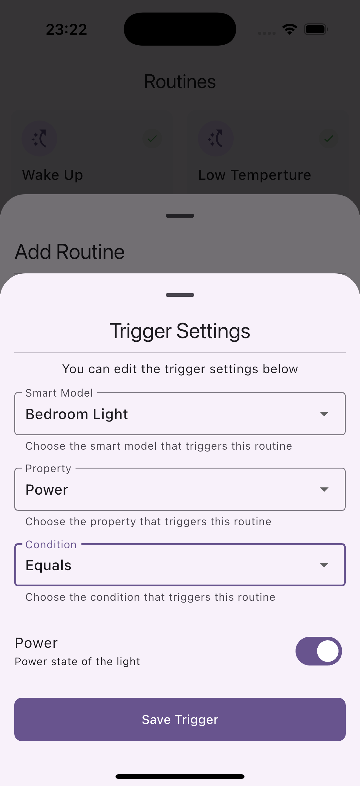

# Smart Routines

![coverage][coverage_badge]
[![style: very good analysis][very_good_analysis_badge]][very_good_analysis_link]
[![License: MIT][license_badge]][license_link]

_Smart Routines_ is an application designed to help users create and manage their daily routines efficiently.
Create custom routines, set automations based on smart devices and services, and enjoy a user-friendly interface with cross-platform support.

## Key Features 🚀

- **Custom Routines**: Create custom routines with a variety of tasks and activities.
- **Smart Device Integration**: Automate your routines based on smart devices and services.
- **Cross-Platform Support**: Enjoy a consistent experience across multiple platforms.

## Design 🎨

_Smart Routines_ follows the [Material 3](https://m3.material.io/) design guidelines to provide a consistent and intuitive user experience.

## Screenshots 📸
### Tablet
| Dashboard | Model Details | Routines |
|:---:|:---:|:---:|
|  |  |  |

| Routine Details | Add Routine | Trigger Settings | Action Settings |
|:---:|:---:|:---:|:---:|
|  |  |  |  |


### Mobile
| Dashboard | Model Details | Routines |
|:---:|:---:|:---:|
|  |  |  |

| Routine Details | Add Routine | Trigger Settings | Action Settings |
|:---:|:---:|:---:|:---:|
|  |  |  |  |

## Demo Video 📹

[![Smart Routines Demo][demo_video_placeholder]][demo_video_link]

## Tech Stack 🛠

- **Language**: Dart
- **Framework**: Flutter
- **State Management**: Flutter Bloc
- **Dependency Injection**: GetIt, Injectable

## Packages Used 📦

- [flutter_bloc](https://pub.dev/packages/flutter_bloc): State management library for Flutter applications.
- [equatable](https://pub.dev/packages/equatable): Simplifies the implementation of equality and hash code methods.
- [freezed](https://pub.dev/packages/freezed): Code generation for immutable classes.
- [get_it](https://pub.dev/packages/get_it): Simple service locator for Flutter applications.
- [injectable](https://pub.dev/packages/injectable): Dependency injection for Flutter applications.
- [auto_route](https://pub.dev/packages/auto_route): Code generation for Flutter navigation.
- [drift](https://pub.dev/packages/drift): Database migration and schema management for Flutter applications.
- [mocktail](https://pub.dev/packages/mocktail): Mocking library for Dart and Flutter.
- [very_good_analysis](https://pub.dev/packages/very_good_analysis): Lint rules and analysis options for Dart and Flutter projects.

## Architecture Diagram 🏗


## Getting Started 🚀

To get started with Smart Routines, follow these steps:

1. Clone the repository:
   ```bash
   git clone https://github.com/furkankurt/smart_routines.git
   ```
2. Navigate to the project directory:
   ```bash
   cd smart_routines
   ```
3. Install the dependencies:
   ```bash
   flutter pub get
   ```

To run the application on your device or emulator, use the following command:

```bash
flutter run
```

## Running Tests 🧪

To run all unit and widget tests use the following command:

```sh
flutter test --coverage --test-randomize-ordering-seed random
```

To view the generated coverage report you can use [lcov](https://github.com/linux-test-project/lcov).

If you don't have `lcov` installed, you can install it using the following command:

```sh
brew install lcov
```

To generate and view the coverage report, you can use the following commands:

```sh
# Ignore Flutter generated files
lcov --remove coverage/lcov.info 'lib/**/*.g.dart' -o coverage/lcov.info --ignore-errors unused

# Generate and Open Coverage Report
genhtml coverage/lcov.info -o coverage/ && open coverage/index.html
```
The coverage report will be generated in the `coverage` directory and you can view it by opening the `index.html` file.


Or you can use the following command to run the tests and generate the coverage report:

```sh
make flutter_test
```

## Contributing 🤝

We welcome contributions to Smart Routines! To contribute, follow these steps:

1. Fork the repository.
2. Create a new branch:
   ```bash
   git checkout -b feature-branch
   ```
3. Make your changes and commit them:
   ```bash
   git commit -m "Description of your changes"
   ```
4. Push to the branch:
   ```bash
   git push origin feature-branch
   ```
5. Create a pull request.

---

[license_badge]: https://img.shields.io/badge/license-MIT-blue.svg
[coverage_badge]: coverage_badge.svg
[license_link]: https://opensource.org/licenses/MIT
[very_good_analysis_badge]: https://img.shields.io/badge/style-very_good_analysis-B22C89.svg
[very_good_analysis_link]: https://pub.dev/packages/very_good_analysis
[demo_video_placeholder]: https://img.youtube.com/vi/MlnAkHX7lGI/0.jpg
[demo_video_link]: https://www.youtube.com/watch?v=MlnAkHX7lGI
